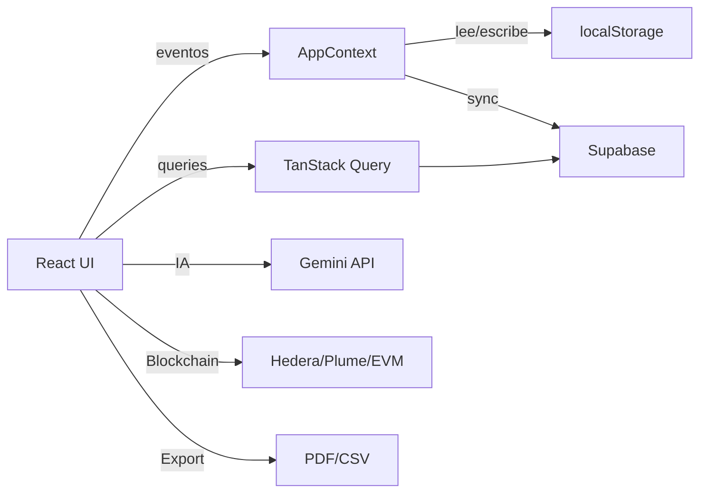
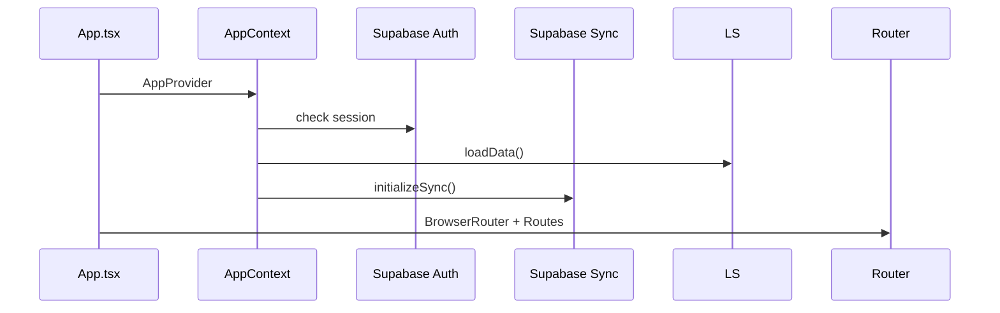
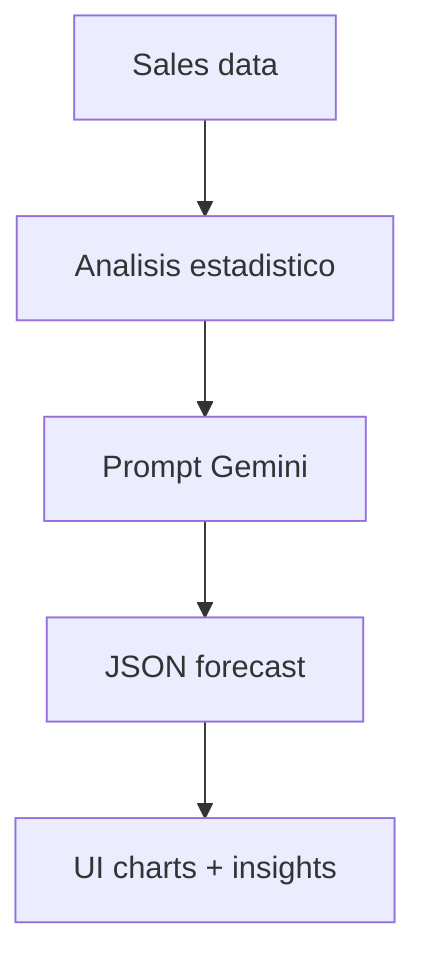
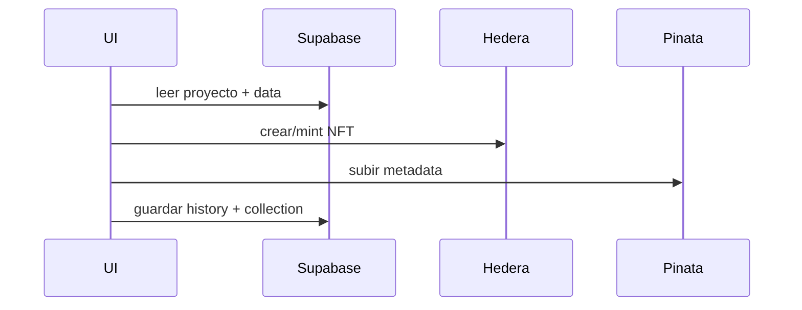
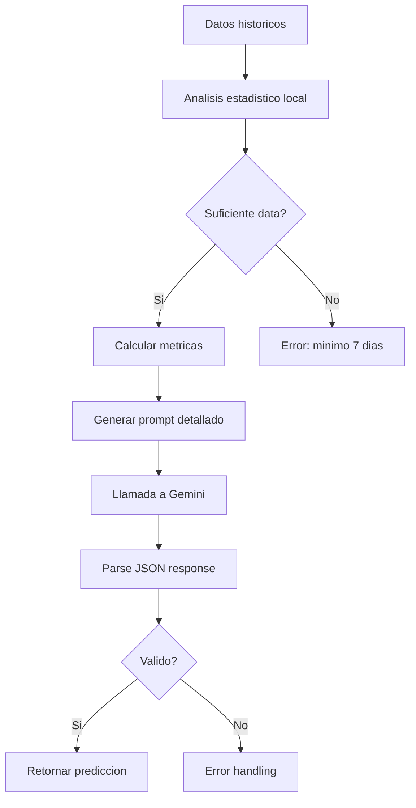
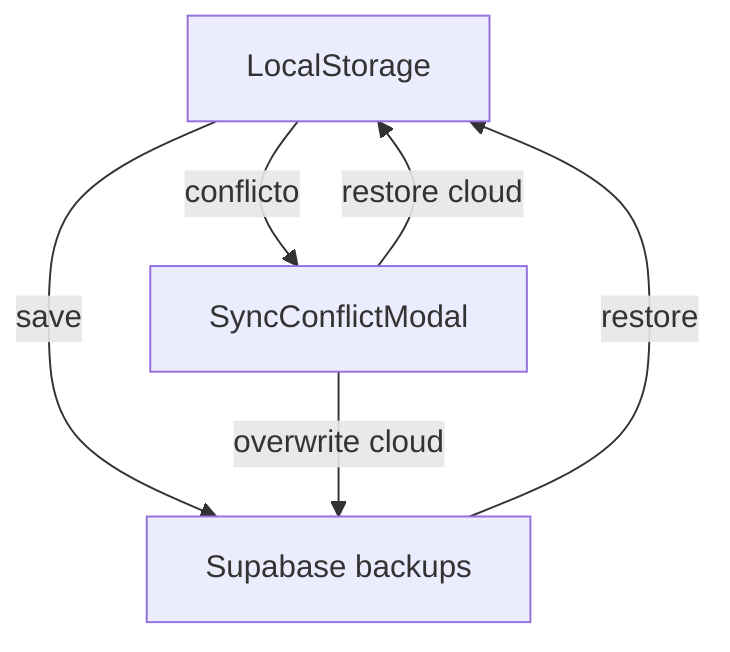
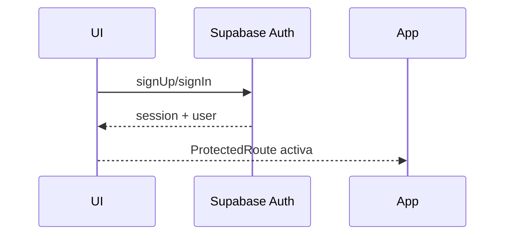

# ESPECIFICATIONS

## 1. Proposito y alcance

Este documento describe de forma tecnica la plataforma Polaris, cubriendo arquitectura, rutas, modulos, datos, sincronizacion, integraciones, y componentes principales.
Alcance: frontend + Supabase/BD + scripts/documentacion tecnica.

## 2. Stack tecnologico

- Runtime: Vite + React 18 + TypeScript
- Routing: react-router-dom
- Estado y datos remotos: React Context + TanStack Query
- UI: Tailwind CSS + Radix UI + Lucide Icons + Recharts
- Persistencia local: localStorage
- Backend as a Service: Supabase (Auth + Postgres + RLS)
- IA: Google Generative AI (Gemini)
- Blockchain: Hedera SDK, Ethers, Web3
- Exportacion: jsPDF, CSV

## 3. Arquitectura de alto nivel

## 4. Flujo de arranque

## 5. Routing y control de acceso

Reglas:

- PublicRoute: si hay usuario, redirige a "/".
- ProtectedRoute: si no hay usuario, redirige a "/onboarding".

Tabla de rutas (App.tsx):
| Ruta | Componente | Guard |
| --- | --- | --- |
| /onboarding | Onboarding | PublicRoute |
| / | Dashboard | ProtectedRoute |
| /ingresos | Ventas | ProtectedRoute |
| /ingresos/:id | Ingreso | ProtectedRoute |
| /gastos | Gastos | ProtectedRoute |
| /gastos/:id | Gasto | ProtectedRoute |
| /inventario | Inventario | ProtectedRoute |
| /inventario/:id | Item | ProtectedRoute |
| /servicios | Servicios | ProtectedRoute |
| /analisis | Analisis | ProtectedRoute |
| /compar/:pair | Comparador | ProtectedRoute |
| /proyecciones | Proyecciones | ProtectedRoute |
| /reportes | Reportes | ProtectedRoute |
| /herramientas | Herramientas | ProtectedRoute |
| /herramientas/facturador | Facturador | ProtectedRoute |
| /herramientas/agenda | Agenda | ProtectedRoute |
| /herramientas/crm | MiniCRM | ProtectedRoute |
| /herramientas/metas | Metas | ProtectedRoute |
| /herramientas/precios | PreciosDinamicos | ProtectedRoute |
| /herramientas/deudas | Deudas | ProtectedRoute |
| /herramientas/posts | PostsRedes | ProtectedRoute |
| /herramientas/pagos-recurrentes | PagosRecurrentes | ProtectedRoute |
| /premium | Premium | ProtectedRoute |
| /teams | Teams | ProtectedRoute |
| /history | History | ProtectedRoute |
| /wallet | Wallet | ProtectedRoute |
| /chatbot | Chatbot | ProtectedRoute |
| /configuracion | Configuracion | ProtectedRoute |
| \* | NotFound | Public |

## 6. Layout, navegacion y permisos

AppLayout:

- Sidebar + top header + contenido con <Outlet />.
- Menu principal: Dashboard, Ingresos, Gastos, Inventario, Servicios, Analisis, Proyecciones, Reportes, Herramientas, Premium, Configuracion.
- Menu extra (herramientas): CRM, Facturador, Metas, Recurrencia, Precios dinamicos, Deudas, Posts.
- Indicador de sincronizacion: AutoSyncIndicator.

Permisos por departamento (DEPARTMENT_PERMISSIONS):

- direccion: all
- ventas: /ingresos, /herramientas/crm
- recursos_humanos: /herramientas/crm, /herramientas/agenda
- logistica: /inventario
- marketing: /herramientas/posts
- economia: /servicios, /gastos, /analisis, /proyecciones, /reportes, /herramientas/facturador, /herramientas/metas, /herramientas/pagos-recurrentes, /herramientas/precios, /herramientas/deudas, /herramientas/crm

## 7. Modelo de datos (AppData)

Fuente: src/lib/storage.ts

Entidades principales:

- Sale: id, date, amount, category, description?, productId?, quantity?, tags?, clientId?
- Expense: id, date, amount, category, description?, tags?, isRecurring?, recurringId?, recurringTime?, clientId?
- RecurringPayment: id, name, amount, category, frequency, dayOfMonth?, isActive, lastPaidDate?, createdAt
- Product: id, name, quantity, cost, price, category?, minStock?, expirationDate?, barcode?, supplierId?, additionalPrices?, isNft?, nftAddress?, nftMarketplace?, type?, components?
- Supplier: id, name, phone?, email?, address?, notes?, createdAt
- SupplierOrder: id, supplierId, items[], status, totalAmount, expectedDate?, notes?, createdAt
- Client: id, name, phone?, email?, address?, type, notes?, createdAt
- Worker: id, name, role?, salary, phone?, email?, createdAt
- CalendarEvent: id, title, date, time?, type, description?, completed
- FinancialGoal: id, title, targetAmount, currentAmount, deadline, category, createdAt
- ReinvestmentGoal: id, name, percentage, dayOfMonth, isActive, walletId?, createdAt
- ReinvestmentExecution: id, goalId, date, amount
- Debt: id, personName, amount, type, description?, dueDate?, paid, createdAt
- Service: id, name, priceType, price?, description?, items?, associatedExpense?, createdAt
- ServiceIncome: id, date, serviceId, amount, quantity?, description?, tags?, clientId?
- DepartmentBudgetTransaction: id, projectId?, type, fromDepartment, toDepartment, amount, status, createdAt, createdBy, createdByDepartment?, approvedAt?, approvedBy?, reason?
- Settings: currency, currencySymbol, language, theme, businessName?, businessLogo?, businessPhone?, businessAddress?, businessEmail?, isPremium?

## 8. Persistencia local

- Clave principal: negocio360_data
- Metadatos de version: negocio360_data_updated
- Tema UI: negocio360_theme
- Onboarding: negocio360_onboarding_completed

Persistencia:

- loadData() carga y normaliza AppData desde localStorage.
- saveData() guarda AppData.
- generateDemoData() inicializa datos base si no existe data previa.

## 9. Supabase (auth + sync + tablas)

Cliente:

- src/lib/supabase.ts crea el cliente con VITE_SUPABASE_URL y VITE_SUPABASE_PUBLISHABLE_KEY.

Auth (use-supabase-auth):

- register(email, password) crea usuario y genera wallet Hedera en tabla wallets.
- login(email, password) inicia sesion.
- logout() cierra sesion.

Sync (use-supabase-sync):

- saveToSupabase(data, force?) guarda data en tabla backups.
- loadFromSupabase() trae data mas reciente (compara updated_at vs local).
- checkSyncStatus() compara timestamps local vs nube.
- restoreFromCloud() trae data remota.
- initializeSync() detecta conflicto (nube con mas data o local vacio).

Resolucion de conflictos:

- SyncConflictModal muestra comparacion local vs nube.
- Accion A: restaurar nube -> sobreescribe local.
- Accion B: forzar subida -> sobreescribe nube.

Tablas Supabase (documentadas en SQL):

- backups: respaldo JSON por usuario (RLS)
- projects: proyectos en equipo (usa members jsonb)
- project_sales, project_expenses, project_products, project_clients, project_workers, project_events, project_goals, project_debts, project_recurring_payments, project_suppliers, ...
- wallets: wallet Hedera por usuario
- personal_wallets: wallets personales (balance y nombre)
- personal_wallet_transfers: transferencias entre wallets personales

## 10. IA (Gemini)

API key requerida: VITE_GOOGLE_AI_API_KEY

Modulos:

- chatbot.ts: sendChatMessage() con modelo gemini-2.5-flash-lite
- salesPredictor.ts: predictSales(), getSalesInsights(), comparePeriods() via hooks
- invoiceGenerator.ts: generateInvoiceDraft() con items y terms
- reportGenerator.ts: generateExecutiveReport() en JSON estructurado
- postGenerator.ts: generateSocialPost() (estrategia + hashtags)
- categorySuggester.ts: suggestCategories() para tags
- goalGenerator.ts: generateFinancialGoals()
- agendaPlanner.ts: generateAgendaPlan()

Flujo de prediccion:

## 11. Notificaciones

- buildSystemNotifications() en src/lib/notifications.ts
- Regla para: stock bajo, vencimientos, eventos, metas, deudas, pagos recurrentes.
- use-notification-push.ts gestiona permiso, sonido, y Notification API.

## 12. Exportacion

- exportToPDF(): tabla + resumen con jsPDF
- exportToExcel(): CSV compatible con Excel

## 13. Wallet y blockchain

- getUserWallet(): obtiene wallet Hedera de Supabase.
- createHederaWallet(): crea cuenta en testnet Hedera.
- sendFunds(): ETH/EVM via ethers (RPC VITE_RPC_URL si existe).
- PUSD token (Plume): getPusdBalance(), sendPusd(), getPusdTransfers().
- NFT: creacion de colecciones en Hedera + metadata en IPFS (Pinata).
- Pinata: VITE_PINATA_JWT_SECRET y VITE_PINATA_URL.

Flujo NFT de proyectos:

## 14. UI y componentes

Estructura:

- src/components/layout: AppLayout
- src/components/dashboard: BalanceHistory, CashFlowAlerts, GoalsState, RecurringPaymentsCard
- src/components/forms: ExpenseForm, ProductForm, SaleForm, ServiceForm, ServiceIncomeForm, TagSelector
- src/components/inventory: BarcodeScanner, ExpirationAlerts
- src/components/ui: wrappers Radix + componentes de producto (AutoSyncIndicator, BottomTabbar, DataComparisonModal, CategorySuggestionsModal, AISalesForecast, ChatbotUI, ExportButtons, NotificationToast, SyncConflictModal, etc.)

Nota: los componentes UI se basan en Radix y Tailwind, con utilidades en cn().

## 15. Paginas (pages)

Listado (src/pages):
Agenda, Analisis, Chatbot, Comparador, Configuracion, Dashboard, Deudas, Facturador, Gasto, Gastos, Herramientas, History, Index, Ingreso, Inventario, Item, Metas, MiniCRM, NotFound, Notificaciones, Onboarding, PagosRecurrentes, PostsRedes, PreciosDinamicos, Premium, Proveedores, Proyecciones, Reportes, Servicios, Teams, Ventas, Wallet.

## 16. Herramientas de la plataforma

### 16.1 Herramientas principales (modulos core)

#### Dashboard (/)

**Proposito**: Panel central de control con metricas clave del negocio.
**Funcionalidades**:

- Resumen de ingresos y gastos del periodo
- Balance actual y flujo de caja
- Graficos de tendencias
- Alertas de stock bajo y proximos vencimientos
- Estado de metas financieras
- Pagos recurrentes pendientes
- Acceso rapido a todas las secciones

#### Ingresos (/ingresos)

**Proposito**: Gestion completa de ventas e ingresos.
**Funcionalidades**:

- Registro manual de ventas o desde inventario
- Vinculacion con productos (descuenta stock automaticamente)
- Vinculacion con clientes
- Categorizacion con tags personalizados
- Soporte para productos compuestos (combos)
- Historial completo de transacciones
- Filtros por fecha, categoria, cliente
- Exportacion a PDF/Excel

#### Gastos (/gastos)

**Proposito**: Control y seguimiento de todos los gastos del negocio.
**Funcionalidades**:

- Registro de gastos con categorias personalizadas
- Tags para clasificacion avanzada
- Vinculacion con proveedores
- Marcado de gastos recurrentes
- Alertas de presupuesto
- Analisis por categoria y periodo
- Exportacion de reportes

#### Inventario (/inventario)

**Proposito**: Gestion integral de productos y stock.
**Funcionalidades**:

- Control en tiempo real del inventario
- Productos simples y compuestos (kits/combos)
- Escaneo de codigos de barras (via camara)
- Alertas de stock minimo
- Control de fechas de vencimiento
- Multiples precios por producto
- Vinculacion con proveedores
- Historial de movimientos
- Soporte para productos NFT (blockchain)
- Calculadora de margenes (costo vs precio)

#### Servicios (/servicios)

**Proposito**: Catalogo y registro de servicios ofrecidos.
**Funcionalidades**:

- Catalogo de servicios con precios fijos o variables
- Vinculacion con items del inventario (consumibles)
- Registro de ingresos por servicio
- Gastos asociados automaticos (ej: comision de inversor)
- Historial de servicios prestados
- Analisis de rentabilidad por servicio

### 16.2 Herramientas de analisis

#### Analisis (/analisis)

**Proposito**: Visualizacion avanzada de metricas comerciales.
**Funcionalidades**:

- Graficos interactivos de ingresos y gastos
- Analisis de tendencias temporales
- Distribucion por categorias
- Top productos mas vendidos
- Analisis de clientes frecuentes
- Metricas de rentabilidad
- Comparativas periodo vs periodo
- Predicciones con IA

#### Comparador (/compar/:pair)

**Proposito**: Comparacion directa entre dos periodos de tiempo.
**Funcionalidades**:

- Seleccion de dos rangos de fechas
- Comparacion lado a lado de metricas
- Variacion porcentual y absoluta
- Graficos comparativos
- Identificacion de tendencias (crecimiento/declive)
- Recomendaciones de IA

#### Proyecciones (/proyecciones)

**Proposito**: Predicciones financieras con inteligencia artificial.
**Funcionalidades**:

- Pronostico de ventas (30-90 dias) con IA Gemini
- Analisis de confianza del modelo
- Deteccion de tendencias (creciente/estable/decreciente)
- Recomendaciones accionables
- Insights de patrones estacionales
- Visualizacion de datos historicos vs predichos

#### Reportes (/reportes)

**Proposito**: Generacion de reportes ejecutivos detallados.
**Funcionalidades**:

- Reportes automaticos con IA (formato ejecutivo)
- Resumen de hechos clave
- Analisis de causa raiz
- Impacto en el negocio
- Recomendaciones priorizadas
- Alternativas con trade-offs
- Pasos siguientes accionables
- Riesgos si no se actua
- Exportacion a PDF

### 16.3 Herramientas avanzadas (/herramientas)

#### Facturador (/herramientas/facturador)

**Proposito**: Generacion de facturas profesionales con IA.
**Funcionalidades**:

- Generacion de borradores de factura con IA Gemini
- Extraccion automatica de datos de empresa y cliente
- Items sugeridos basados en productos y servicios
- Terminos y condiciones automaticos
- Notas de cortesia personalizadas
- Calculo automatico de impuestos
- Vista previa y edicion
- Exportacion a PDF

#### Agenda (/herramientas/agenda)

**Proposito**: Calendario y planificador inteligente.
**Funcionalidades**:

- Calendario mensual interactivo
- Creacion de eventos (recordatorios, citas, pagos)
- Generacion de planes con IA (PM-style)
- Alertas de eventos proximos
- Integracion con metas y objetivos
- Asignacion de responsables (si hay equipo)
- Vista de eventos completados/pendientes

#### Mini CRM (/herramientas/crm)

**Proposito**: Gestion de relaciones con clientes y proveedores.
**Funcionalidades**:

- Base de datos de clientes
- Base de datos de proveedores
- Historial de compras por cliente
- Contactos y notas de negocio
- Seguimiento de interacciones
- Segmentacion por tipo
- Ordenes a proveedores (pendientes/recibidas)
- Analisis de clientes frecuentes

#### Metas (/herramientas/metas)

**Proposito**: Establecimiento y seguimiento de objetivos financieros.
**Funcionalidades**:

- Creacion de metas financieras (ventas, ahorro, reduccion gastos)
- Generacion de metas con IA basadas en data historica
- Seguimiento de progreso visual
- Metas de reinversion automatica (con vinculos a wallets)
- Alertas de metas proximas a vencer
- Historial de ejecuciones de reinversion
- Analisis de cumplimiento

#### Precios Dinamicos (/herramientas/precios)

**Proposito**: Gestion avanzada de precios por producto.
**Funcionalidades**:

- Multiples listas de precios por producto
- Precios por canal (mayorista, minorista, online)
- Precios por cliente o segmento
- Calculadora de margenes
- Sugerencias de precios competitivos
- Historial de cambios de precio

#### Deudas (/herramientas/deudas)

**Proposito**: Control de cuentas por cobrar y por pagar.
**Funcionalidades**:

- Registro de deudas (me deben / debo)
- Fechas de vencimiento
- Alertas de vencimientos proximos
- Marcado de deudas pagadas
- Historial de transacciones
- Analisis de credito por cliente
- Gestion de cobranza

#### Posts Redes Sociales (/herramientas/posts)

**Proposito**: Generacion de contenido para redes sociales con IA.
**Funcionalidades**:

- Generacion de contenido con IA Gemini
- Soporte para multiples redes (Instagram, Facebook, Twitter, TikTok)
- Tipos de post: ventas, producto, promocion, logro, agradecimiento, rifa
- Generacion de hashtags relevantes
- Estrategia de publicacion
- Recomendacion de tipo de contenido (reel, carrusel, imagen, historia)
- Copy listo para publicar

#### Pagos Recurrentes (/herramientas/pagos-recurrentes)

**Proposito**: Automatizacion de pagos y cobros periodicos.
**Funcionalidades**:

- Registro de pagos recurrentes (diarios, semanales, mensuales, anuales)
- Calculo automatico de proximos vencimientos
- Alertas de pagos proximos
- Marcado de pago realizado (genera gasto automatico)
- Activacion/desactivacion de recurrencias
- Historial de ejecuciones
- Proyeccion de gastos futuros

### 16.4 Herramientas premium y colaborativas

#### Premium (/premium)

**Proposito**: Informacion sobre funcionalidades premium.
**Funcionalidades**:

- Descripcion de beneficios premium
- Sincronizacion en la nube
- Proyectos en equipo
- Reportes avanzados con IA
- Wallets blockchain
- Encriptacion de datos
- Analisis predictivo
- Soporte prioritario

#### Teams (/teams)

**Proposito**: Gestion de proyectos colaborativos.
**Funcionalidades**:

- Creacion de proyectos empresariales
- Gestion de miembros por departamento
- Roles y permisos granulares
- Balance inicial de proyecto
- Wallets del proyecto (Hedera)
- Minting de NFT por periodo
- Historial de periodos en blockchain
- Transacciones entre departamentos
- Solicitudes de presupuesto
- Retiros de emergencia

#### Wallet (/wallet)

**Proposito**: Gestion de billeteras digitales y blockchain.
**Funcionalidades**:

- Wallet principal Hedera (testnet)
- Balance en HBAR
- Balance en PUSD (Plume Network)
- Envio y recepcion de fondos
- Historial de transacciones
- Multiples wallets personales (para organizacion financiera)
- Transferencias entre wallets personales
- Metas de reinversion vinculadas a wallets
- Reconciliacion con ingresos/gastos
- Exploradores de blockchain

#### Chatbot (/chatbot)

**Proposito**: Asistente financiero conversacional con IA.
**Funcionalidades**:

- Chat con IA Gemini (Polo, asistente profesional)
- Contexto completo del negocio
- Respuestas en Markdown estructurado
- Efecto de escritura en tiempo real
- Historial de conversacion
- Analisis y consejos accionables
- Consultas sobre metricas
- Soporte multimodal

### 16.5 Configuracion y utilidades

#### Configuracion (/configuracion)

**Proposito**: Ajustes generales de la aplicacion.
**Funcionalidades**:

- Configuracion de moneda y simbolo
- Datos del negocio (nombre, logo, contacto)
- Tema claro/oscuro
- Gestion de etiquetas personalizadas
- Gestion de categorias personalizadas
- Sugerencias de categorias con IA
- Autenticacion Supabase (login/registro)
- Sincronizacion manual (forzar subida/descarga)
- Exportacion completa de datos (JSON)
- Importacion de datos
- Reset de datos (con confirmacion)

#### Notificaciones (/notificaciones)

**Proposito**: Centro de notificaciones del sistema.
**Funcionalidades**:

- Notificaciones de stock bajo
- Alertas de vencimiento de productos
- Recordatorios de eventos
- Alertas de metas proximas
- Avisos de deudas vencidas
- Notificaciones de pagos recurrentes
- Push notifications (con permiso)
- Historial de notificaciones

#### History (/history)

**Proposito**: Historial de actividad del proyecto.
**Funcionalidades**:

- Registro de periodos cerrados
- Metadatos de NFTs minteados
- Enlaces a IPFS y exploradores
- Totales por periodo
- Timeline visual
- Detalles de inventario por periodo

## 17. Integraciones con Inteligencia Artificial (Gemini)

### 17.1 Configuracion de IA

**API utilizada**: Google Generative AI (Gemini)
**Modelo**: gemini-2.5-flash-lite
**Variable de entorno**: VITE_GOOGLE_AI_API_KEY
**Tier gratuito**: Si (generoso, sin tarjeta de credito requerida)

### 17.2 Modulos de IA implementados

#### Chatbot financiero (src/lib/ai/chatbot.ts)

**Funcion**: sendChatMessage()
**Proposito**: Asistente conversacional profesional llamado Polo
**Caracteristicas**:

- Contexto completo del negocio (ventas, productos, clientes, data de nube)
- Respuestas en Markdown estructurado
- Tono profesional, objetivo y conciso
- Consejos accionables basados en datos reales
- Historial de conversacion mantenido en el cliente
- Maxima salida: 1024 tokens

**Uso**: Pagina /chatbot
**Prompt incluye**: Resumen de productos, ventas, clientes, estado de sincronizacion

#### Predictor de ventas (src/lib/ai/salesPredictor.ts)

**Funciones**:

- predictSales(sales, daysAhead): Pronostico de ventas futuras
- getSalesInsights(sales): Analisis de patrones
- comparePeriods(period1, period2): Comparacion de periodos

**Proposito**: Predicciones financieras con analisis estadistico y IA
**Caracteristicas**:

- Requiere minimo 7 dias de datos
- Analisis de tendencias (growing/stable/declining)
- Deteccion de estacionalidad
- Calculo de volatilidad
- Nivel de confianza (0-100%)
- Recomendaciones especificas
- Maxima salida: 2048 tokens

**Uso**: Pagina /proyecciones con componente AISalesForecast
**Metodo**: Pre-analisis estadistico + prompt detallado para Gemini
**Output**: JSON con forecast[], confidence, analysis, recommendations, trend

**Diagrama de flujo**:

#### Generador de facturas (src/lib/ai/invoiceGenerator.ts)

**Funcion**: generateInvoiceDraft()
**Proposito**: Crear borradores de factura inteligentes
**Caracteristicas**:

- Genera items basados en productos y servicios
- Extrae datos de empresa y cliente del prompt del usuario
- Sugiere terminos de pago
- Calcula tasas de impuesto
- Notas de cortesia personalizadas
- Maxima salida: 1024 tokens

**Uso**: Pagina /herramientas/facturador
**Input**: appData, businessInfo, clientInfo, brief del usuario
**Output**: JSON con items[], terms, notes, taxRate, businessName, clientName

#### Generador de reportes ejecutivos (src/lib/ai/reportGenerator.ts)

**Funcion**: generateExecutiveReport()
**Proposito**: Reportes narrativos estilo ejecutivo/PM
**Caracteristicas**:

- Resumen ejecutivo con hechos clave
- Analisis de causa raiz
- Impacto en el negocio
- Recomendaciones priorizadas
- Alternativas con trade-offs
- Pasos siguientes accionables
- Riesgos si no se actua
- Maxima salida: 2400 tokens
- Response en JSON estricto

**Uso**: Pagina /reportes
**Input**: Resumen de metricas del ultimo mes
**Output**: JSON estructurado con executiveSummary, context, metrics[], rootCause, businessImpact, recommendation, alternatives[], nextSteps[], risksIfNoAction

#### Generador de posts sociales (src/lib/ai/postGenerator.ts)

**Funcion**: generateSocialPost()
**Proposito**: Contenido para redes sociales listo para publicar
**Caracteristicas**:

- Tipos: ventas, producto, promocion, logro, agradecimiento, rifa
- Redes: Instagram, Facebook, Twitter, TikTok, LinkedIn
- Generacion de hashtags (5-12)
- Estrategia de publicacion
- Recomendacion de tipo de contenido (reel, carrusel, imagen, historia, hilo)
- Maxima salida: 1024 tokens

**Uso**: Pagina /herramientas/posts
**Input**: appData, businessInfo, red social, tipo de post, producto?, brief del usuario
**Output**: JSON con content, hashtags[], strategy, contentType

#### Sugeridor de categorias (src/lib/ai/categorySuggester.ts)

**Funcion**: suggestCategories()
**Proposito**: Sugerir tags/categorias personalizadas basadas en patrones de uso
**Caracteristicas**:

- Analiza gastos por categoria
- Analiza ingresos por descripcion
- Analiza productos por categoria
- Sugiere 5-10 nuevas categorias
- Filtra duplicados y existentes
- Maxima salida: 512 tokens

**Uso**: Pagina /configuracion (modal CategorySuggestionsModal)
**Input**: appData completo
**Output**: Array de strings con categorias sugeridas

#### Generador de metas (src/lib/ai/goalGenerator.ts)

**Funcion**: generateFinancialGoals()
**Proposito**: Crear metas financieras realistas y adaptadas
**Caracteristicas**:

- Analiza ventas y gastos de ultimos 30 dias
- Calcula ticket promedio
- Genera 2-4 metas
- Fechas limite realistas (3-6 meses)
- Categorias: ventas, ahorro, reduccion_gastos, otro
- Maxima salida: 1024 tokens

**Uso**: Pagina /herramientas/metas
**Input**: appData, currencySymbol, brief del usuario
**Output**: JSON con goals[], rationale

#### Planificador de agenda (src/lib/ai/agendaPlanner.ts)

**Funcion**: generateAgendaPlan()
**Proposito**: Generar agenda basada en objetivos (PM-style)
**Caracteristicas**:

- Enfoque en objetivos (no solo eventos)
- Bloques de trabajo (reuniones, analisis, deep work)
- Asignacion de responsables
- Horarios laborales (08:00-19:00)
- Evita conflictos con eventos existentes
- Maxima salida: 1024 tokens

**Uso**: Pagina /herramientas/agenda
**Input**: objetivo PM, appData, eventos existentes, fecha inicio, dias
**Output**: JSON con events[], rationale

### 17.3 Estrategias de prompting

**Estructura de prompts**:

1. Definicion de rol (ej: "Eres Polo, asistente financiero profesional")
2. Contexto de negocio (datos relevantes del appData)
3. Tarea especifica con formato de salida
4. Reglas y restricciones
5. Formato de salida (JSON preferido)

**Manejo de errores**:

- try/catch en todas las llamadas
- Validacion de JSON response
- Fallbacks si no hay API key
- Mensajes de error descriptivos
- Retry logic donde aplica (TanStack Query)

### 17.4 Caching y optimizacion

**TanStack Query** para caching:

- useSalesPrediction: cache 1 hora (staleTime: 3600000ms)
- useSalesInsights: cache 4 horas
- useSalesComparison: cache 4 horas

**Debouncing**: No se hacen llamadas redundantes en corto tiempo

### 17.5 Limitaciones y consideraciones

- Requiere API key de Google (gratuita)
- Rate limits de Gemini (generosos en tier gratuito)
- Tiempo de respuesta: 10-30 segundos para predictions
- Calidad depende de cantidad/calidad de datos historicos
- Respuestas en castellano

## 18. Variables de entorno

Requeridas o usadas en runtime:

- VITE_SUPABASE_URL
- VITE_SUPABASE_PUBLISHABLE_KEY
- VITE_GOOGLE_AI_API_KEY
- VITE_ENCRIPTED_KEY
- VITE_RPC_URL
- VITE_OPERATOR_ID
- VITE_OPERATOR_KEY
- VITE_PLUME_API_BASE
- VITE_PINATA_JWT_SECRET
- VITE_PINATA_URL

## 19. Scripts del proyecto

- dev: Vite dev server
- build: Vite build
- build:dev: Vite build modo development
- lint: ESLint
- preview: Vite preview

## 20. Seguridad

- Cifrado AES-GCM para llaves y payloads (crypto.ts).
- RLS en Supabase para backups y tablas de proyectos.
- Control de acceso en rutas via PublicRoute/ProtectedRoute.

## 21. Observabilidad y UX

- Toasts para eventos criticos (sincronizacion, errores).
- Logs en consola para fallos de red y parseo.

## 22. Diagramas adicionales

### Sincronizacion de datos

### Autenticacion

